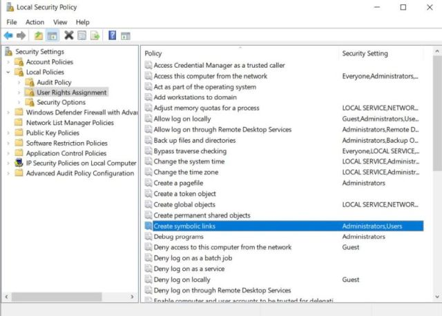
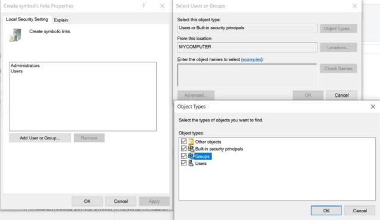
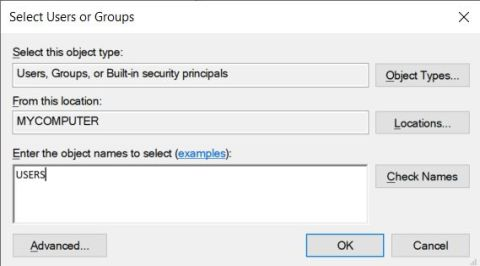

# Allow Symbolic Links on Windows 10

The build process needs to create symbolic links to create 
plugin projects that correspond to different versions of DCC tools,
and by default, this symbolic link creation is not allowed for regular users 
on Windows 10.

Follow these steps to allow symbolic link creations: 

1. Open **Local Security Policy** by typing `secpol.msc` on Windows Command Prompt

   
2. Under **User Rights Assignment**, find a policy called **Create symbolic links** and open it.
   - Click **Add User or Group**
   - Click **Object Types**
   - Make sure **Groups** is checked and click **OK**.
   

3. Type **USERS** inside the textbox and click on **Check Names** to verify it, then click **OK**.

