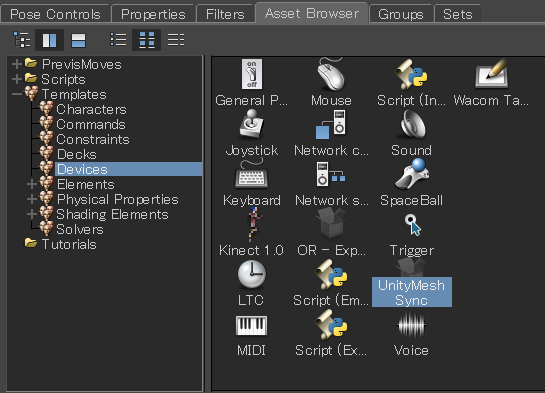

# Installation

1. [Maya](#maya)
1. [3ds Max](#3ds-max)
1. [MotionBuilder](#motionbuilder)
1. [Blender](#blender)

## Maya

1. MeshSync と同じバージョンを持つ最新の Maya プラグインを[リリース](https://github.com/Unity-Technologies/MeshSyncDCCPlugin/releases)から取得。  
   見つからない場合は、[手動でビルド](../en/BuildDCCPlugins.md) (現在英語のみ) をするか、[issueを作成し](https://github.com/Unity-Technologies/MeshSyncDCCPlugin/issues/new)、ご連絡を下さい。
1. プラグインをコピーする
   - Windows:   
     `MAYA_APP_DIR` の環境変数が設定されている場合はそこにコピーする。  
     ない場合は `%USERPROFILE%\Documents\maya` ( Explorer のアドレスバーへコピペで直行) に *modules* ディレクトリをそのままコピーする。
   - Mac:   
     `/Users/Shared/Autodesk/modules/maya` に *UnityMeshSync* ディレクトリと *UnityMeshSync.mod* ファイルをコピーする。
   - Linux:   
     `~/maya/<maya_version>` に *modules* ディレクトリをそのままコピーする。  

1. Maya を起動し、Windows -> Settings/Preferences -> Plug-in Manager を開く。
1. MeshSyncClient の Loaded にチェックを入れてプラグインを有効化する。
1. シェルフ UI に UnityMeshSync が追加されているはずです。  
   歯車アイコンで設定メニューを開き、MeshSync と色々遊んでみましょう。

## 3ds Max

1. MeshSync と同じバージョンを持つ最新の 3ds Max プラグインを[リリース](https://github.com/Unity-Technologies/MeshSyncDCCPlugin/releases)から取得。  
   見つからない場合は、[手動でビルド](../en/BuildDCCPlugins.md) (現在英語のみ) をするか、[issueを作成し](https://github.com/Unity-Technologies/MeshSyncDCCPlugin/issues/new)、ご連絡を下さい。
1. 3ds Max を起動する。
1. 下記のどちらかのフォルダーに、使用されている 3ds Max のバージョンに該当する *MeshSyncClient3dsMax.dlu* をコピーする。
   - **(推奨)**　追加されたプラグイン用のパス。このメニューで追加できます：
     * 3ds Max 2019 以前: Customize -> Configure System Paths をクリックし、*3rd Party Plug-Ins* タブを選択する。
     * 3ds Max 2020: Customize -> Configure User and System Paths をクリックし、*3rd Party Plug-Ins* タブを選択する。
   - 3ds Max のインストールパスの下にあるプラグイン用のパス。  
     例：`C:\Program Files\Autodesk\3ds Max 2019\Plugins`
1. 3ds Max を再起動する。
1. メインメニューバーに "UnityMeshSync" が追加されたのを確認する。
   それの "Window" から設定ウィンドウを開けます。
   - メニューバーを編集する場合、Action に "UnityMeshSync" カテゴリが追加
     されているので、そちらから MeshSync の機能にアクセスできます。

## MotionBuilder

1. MeshSync と同じバージョンを持つ最新の MotionBuilder プラグインを[リリース](https://github.com/Unity-Technologies/MeshSyncDCCPlugin/releases)から取得。  
   見つからない場合は、[手動でビルド](../en/BuildDCCPlugins.md) (現在英語のみ) をするか、[issueを作成し](https://github.com/Unity-Technologies/MeshSyncDCCPlugin/issues/new)、ご連絡を下さい。
1. MotionBuilder を起動する。
1. Settings -> Preferences -> SDK メニューをクリックし、プラグイン用のパスを追加する 
1. プラグイン用のパスに、使用されている MotionBuilder のバージョンに該当する *MeshSyncClientMotionBuilder.dll* をコピーする。
1. MotionBuilder を再起動する。
1. Asset Browser 内の Templates -> Devices フォルダーに "UnityMeshSync" が追加されたのを確認する。
1. "UnityMeshSync" をシーンに追加する。
1. Navigator 内の Devices -> UnityMeshSync を選択することで、MeshSync の各種設定や機能にアクセスできます。 

## Blender
   
1. MeshSync と同じバージョンを持つ最新の Blender プラグインを[リリース](https://github.com/Unity-Technologies/MeshSyncDCCPlugin/releases)から取得。  
   見つからない場合は、[手動でビルド](../en/BuildDCCPlugins.md) (現在英語のみ) をするか、[issueを作成し](https://github.com/Unity-Technologies/MeshSyncDCCPlugin/issues/new)、ご連絡を下さい。

1. Blender を起動する。
1. Blender のバージョンによって、インストールする方法が少々違います
   - Blender 2.79:
     * File -> User Preferences -> Add-ons を開く。
     * 画面下部の "Install Add-on from file" を押し、プラグインの zip ファイルを指定する。
     * "Import-Export: Unity Mesh Sync" が追加されたのを確認する。        
   - Blender 2.80 以降:
     * Edit -> User Preferences を開く。 
     * ウィンドウの右上の "Install" をクリックし、プラグインの zip ファイルを指定する。
     * "Import-Export: Unity Mesh Sync" が "Add-ons" タブに追加されたのを確認する。

     

1. "Import-Export: Unity Mesh Sync" をチェックし、有効化する。 
1. MeshSync パネルが追加されたのを確認する。
  

   

> 使っている MeshSync のバージョンに該当するプラグインが[リリースページ](https://github.com/Unity-Technologies/MeshSyncDCCPlugin/releases)に見つからない場合、 
  [手動のビルド](../en/BuildDCCPlugins.md) (現在英語のみ) を参考にし、ビルドします。
  
### Caveat

Blender のプラグインをインストールする時、古いバージョンのプラグインがあれば、それを事前にアンインストールしておく必要があります。  
アンインストールの手順：

1. Add-ons メニューから "Import-Export: Unity Mesh Sync" を選択。
1. "Remove" ボタンをクリック。
1. Blender を再起動。
  
