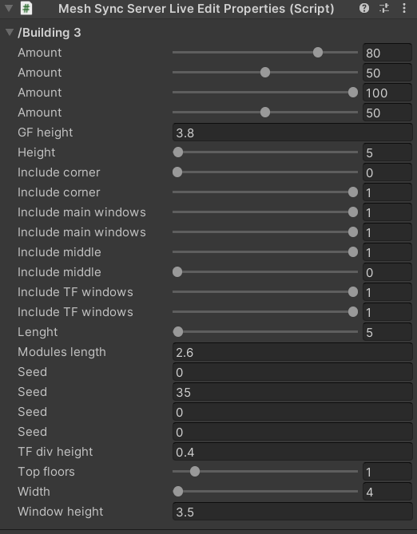
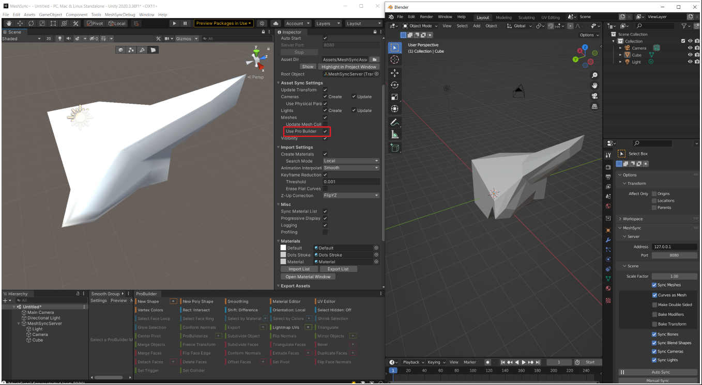

# Usage in Blender

After [installing the plugin](Installation.md), sync controls will be displayed in the MeshSync panel
as can be seen above, where most of the options are self-explanatory.

|**Options** |**Description** |
|:---       |:---|
| **Bake Modifiers** | An option to sync the results after applying all modifiers to get consistent look between Blender and Unity. Refer to [Synchronizable Properties in Unity](#synchronizable-Properties-in-unity) for more details. |

|**Buttons** |**Description** |
|:---       |:---|
| **Auto Sync**             | A toggle that will automatically reflect mesh changes to Unity.|
| **Manual Sync**           | Use the **Manual Sync** button to reflect mesh changes when **Auto Sync** is inactive.|
| Animation &rarr; **Sync** | Bake animations by advancing the timer from the first frame to the final frame, and then send them to Unity.|
| **Export Cache** | Export into an *.sc* file. Please refer to the SceneCache feature in [MeshSync](https://docs.unity3d.com/Packages/com.unity.meshsync@latest).|
| **Material sync mode**    | How to handle materials. Refer to [Material sync mode](#Material-sync-mode) for more details.|

|**Paths** |**Description**|
|:---       |:---|
| **Unity Editors** | Path to the installation folder of the Unity editors. You can find this path in the settings of Unity Hub.| 

## Synchronizable Properties in Unity

The plugin will send the following properties directly to Unity:
1. The polygon mesh's skinning/bone (Armature) 
2. Blend shapes
3. Mirror deformers 

> Other properties will require **Bake Modifiers** enabled to get consistent look between Blender and Unity.
> However, this will also cause the loss of mesh properties in Unity as result of the baking.

---

## Bidirectional Sync

Turn on **Auto-Sync** in the plugin panel to apply property changes in Unity back to Blender.  
This feature is intended for changing Blender's procedural generation parameters from inside Unity, and 
requires Blender 3.0 or higher.

### Editable Properties in Unity

MeshSync synchronizes custom properties on objects and geometry node inputs from Blender 
with the MeshSyncServer **GameObject** in Unity.  
If needed, a MeshSyncServerLiveEditProperties component is automatically created to store, display and edit these properties.

The supported property types are:
* Integer
* Float
* Integer Array
* Float Array
* String (read-only)

### Editing and Synchronizing Meshes from Unity to DCC Tool

We can also edit and send meshes back to Blender if we enable the **Use Pro Builder** option 
in the MeshSyncServer **GameObject** in Unity, which will allow us to change geometry node mesh inputs 
from Unity easily.  
This option will only appear if we install [ProBuilder](https://docs.unity3d.com/Packages/com.unity.probuilder@5.0/manual/index.html) package in the Unity project.

> Due to the way Unity represents a mesh, a mesh will be triangulated when it's sent back to Blender 
> and some mesh data like vertex groups and shape keys, etc. may get lost. 
> If **Bake Modifiers** option is enabled in the plugin, 
> a mesh that is sent from Unity back into Blender will have modifiers applied beforehand and have them removed after.

## Material sync mode

The MeshSyncServer in Unity always creates a material with a default shader for the active render pipeline.
There are multiple options to export materials from blender:

#None:

Only the material names are exported to Unity and default materials created. Users can override the materials in the mapping on the MeshSyncServer to use their own materials.

#Basic:

The materials are synced to Unity in a limited way.
MeshSync looks for an active material output node and exports the BSDF connected to that.
Colors and textures assigned to the active BSDF are exported.

Mix shaders are not fully supported, the first found connected BSDF input to the mix shader is exported instead.

If a BSDF was found, MeshSync exports the following sockets if they exist for that BSDF type:
- Color
- Roughness
- Metallic
- Normal (if a normal map node is used, MeshSync also exports the normal strength)
- Emission
- Emission Strength
- Displacement from the material output node

Only color and texture information is exported. 

Texture coordinates set in blender are not used, the Unity material uses the mesh UVs.

Smoothness and metallic are baked into maps required by Unity depending on the active render pipeline.

All exported textures and baked maps are saved to the Asset Dir set on the MeshSyncServer.