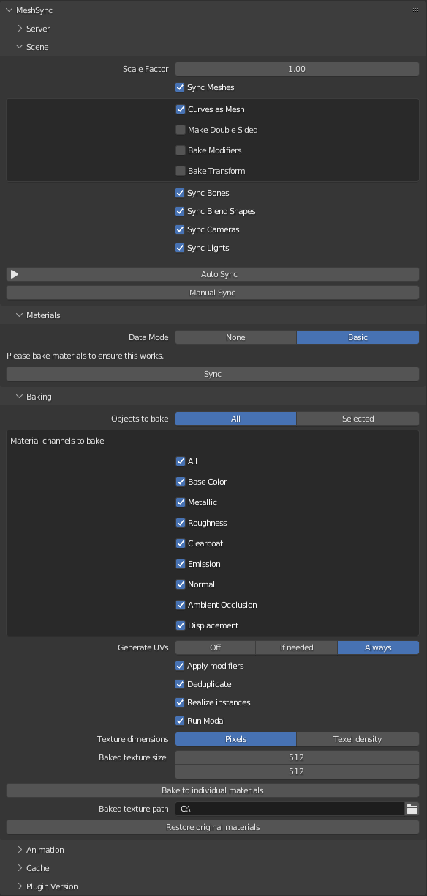

# MeshSyncDCCPlugins Usage in Blender

After [installing the plugin](Installation.md), sync controls will be displayed in the MeshSync panel
as can be seen above

- When "Auto Sync" is selected, changes to the Mesh will automatically be reflected in Unity. If Auto Sync is disabled, use the "Manual Sync" button to sync changes.
- Pressing the Animations Sync button will cause the timer to advance from the first frame to the final frame while baking the animation, then send it to Unity.

&nbsp;

- The polygon mesh's skinning/bone (Armature) and Blendshape will be sent to Unity unchanged. Mirror deformers are also supported. Other deformers will be ignored.
   - Check "Bake Modifiers" to sync the results of applying all modifiers. This will make the Mesh content mostly consistent between  Blender and Unity, but will also result in the loss of Skinning and Blendshape information.
