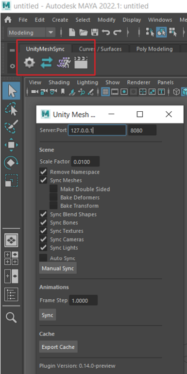

# Installation

## Automatic Installation


[MeshSync](https://docs.unity3d.com/Packages/com.unity.meshsync@latest)'s Preferences page
provides easy installation on several DCC tools.    
Alternatively, we can also [install the plugins manually](#manual-installation).

## Manual Installation


### PackageManager


First, get **MeshSync DCC Plugins** package in a Unity project.
1. Open [Package Manager](https://docs.unity3d.com/Manual/upm-ui.html). 
2. Click the **+** button, and choose **Add package from git URL**.
3. Type in `com.unity.meshsync.dcc-plugins`.

### DCC Tools Setup

1. [Maya](#maya)
1. [3ds Max](#3ds-max)
1. [MotionBuilder](#motionbuilder)
1. [Blender](#blender)
1. [Metasequoia](#metasequoia)
1. [Modo](#modo)

### Maya

1. Open `Packages/MeshSync DCC Plugins/Editor/Plugins` folder using a file explorer 
   and uncompress the appropriate zip file for Maya.
1. Copy the uncompressed files:
   - Windows:   
     If `MAYA_APP_DIR` environment variable is setup, copy the *modules* directory there.  
     If not, go to `%USERPROFILE%\Documents\maya` in Windows Explorer, and copy the *modules* directory there.
   - Mac:   
     Copy the *UnityMeshSync* directory and *UnityMeshSync.mod* file to `/Users/Shared/Autodesk/modules/maya`.
   - Linux:  
     Copy the *modules* directory to `~/maya/<maya_version)`
  
  
1. Start Maya, then go to Windows -> Settings/Preferences -> Plug-in Manager.
1. Activate MeshSync DCC plugin by checking Loaded under *MeshSyncClient*.
1. Notice that *UnityMeshSync* should now be available on the shelf UI.  
  Click on the gear icon to open the settings menu and start playing around with MeshSync.
  


---

### 3ds Max

1. Open `Packages/MeshSync DCC Plugins/Editor/Plugins` folder using a file explorer 
   and uncompress the appropriate zip file for 3ds Max.
1. Start 3ds Max
1. Copy *MeshSyncClient3dsMax.dlu* that corresponds to the used version of 3ds Max into 
   one of the following directories:
   - **(Recommended)** A custom directory for plugins that has been added in 3ds Max by the following menu:
     * 3ds Max 2019 and earlier: Customize -> Configure System Paths. Then select *3rd Party Plug-Ins* tab.
     * 3ds Max 2020: Customize -> Configure User and System Paths. Then select *3rd Party Plug-Ins* tab.
   - The plugin path under the installation directory, e.g: `C:\Program Files\Autodesk\3ds Max 2019\Plugins`
1. Restart 3ds Max 
1. Confirm that "UnityMeshSync" has been added to the main menu bar.
   The settings window can be opened by clicking "Window". 
   > If we change the menu bar, "UnityMeshSync" will be added under Action, which 
   > still allows us to access MeshSync features.


---

### MotionBuilder

1. Open `Packages/MeshSync DCC Plugins/Editor/Plugins` folder using a file explorer 
   and uncompress the appropriate zip file for MotionBuilder.
1. Start MotionBuilder.
1. Add a path for custom plugins by clicking on Settings -> Preferences -> SDK menu.
1. Copy *MeshSyncClientMotionBuilder.dll* that corresponds to the used version of MotionBuilder into 
   the custom plugin path.
1. Restart MotionBuilder.
1. Confirm that "UnityMeshSync" is added in the AssetBrowser under Templates -> Devices folder.
1. Add "UnityMeshSync" to the scene.
1. Start playing around with various MeshSync settings and features by 
   selecting Devices -> UnityMeshSync in the Navigator.


---

### Blender
  
1. Open `Packages/MeshSync DCC Plugins/Editor/Plugins` folder using a file explorer 
   and uncompress the appropriate zip file for Blender.
1. Start Blender
1. Go to Edit -> User Preferences
1. Click "Install" at the top right of the window, and select the appropriate **blender-x.xx.zip** file.
1. Confirm that "Import-Export: Unity Mesh Sync" is added to the Add-ons tab.     
   

1. Check "Import-Export: Unity Mesh Sync" to enable it.
1. Confirm that MeshSync panel is added.
  


#### Caveat

When installing a Blender plugin, the older version has to be uninstalled first if it exists.   
Steps to uninstall:

1. Select "Import-Export: Unity Mesh Sync" from the Add-ons menu.
1. Click "Remove" button.
1. Restart Blender. 
1. On Mac OSX, delete the installed plugin files in the following folder:
    ``` 
    ~/Library/ApplicationSupport/Blender/2.xx/scripts/addons/MeshSyncClientBlender
    ``` 
---

### Metasequoia
  
1. Open `Packages/MeshSync DCC Plugins/Editor/Plugins` folder using a file explorer 
   and uncompress the appropriate zip file for Metasequoia.
1. Start Metasequoia.
1. Go to Help -> About Plug-ins, and click "Install" at the lower left of the Plug-win window.
1. Select the plugin file from the extracted zip file that corresponds to the version of Metasequoia.  
   For example: *MeshSyncClientMQ472.plugin*
1. Go to Panel -> Unity Mesh Sync.  
   If this menu doesn't exist, confirm that "Unity Mesh Sync" is checked in the Plug-in window.


---

### Modo

1. Follow the instructions in [Building Plugins](https://github.com/Unity-Technologies/MeshSyncDCCPlugins/blob/dev/Plugins~/Docs/en/BuildDCCPlugins.md)
   to build MeshSync plugin for Modo.   
   Due to Modo's licensing, manual building is required at the moment.
1. Start Modo.
3. Go to System -> Add Plug-in, and select *MeshSyncClientModo.fx* for the applicable Modo version.
4. Go to Modo's tabs UI, click on *+*, and choose Application -> Custom View -> UnityMeshSync.
1. Confirm that UnityMeshSync view is added in the tabs UI.


#### Caveat

When installing a newer version of the plugin, the existing version must be removed first if it exists.  
Steps to remove:
1. Close all UnityMeshSync views.
1. Restart Modo.

If installing a newer version still fails even after doing the above steps, 
then please try to remove manually after closing Modo.
1. Windows:
   - Open settings file using a text editor.  
     Example: `C:\Users\<user_name>\AppData\Roaming\Luxology\MODO<modo_version>.CFG`
   - Remove UnityMeshSync items like the following:
     ```
     <hash type="Server" key="12345678-abcd-1234-abcd-111122223333:UnityMeshSync">
       <atom type="Module">C:\ModoPlugins\Modo14\MeshSyncClientModo.lx</atom>
       <atom type="Direct">1</atom>
     </hash>
     ```
   - Save the settings file, and restart Modo.


