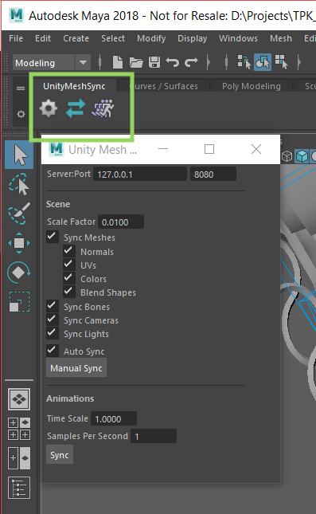
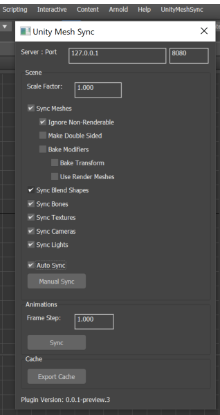
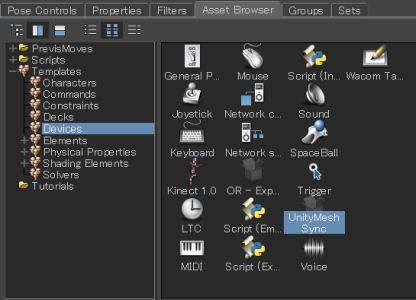
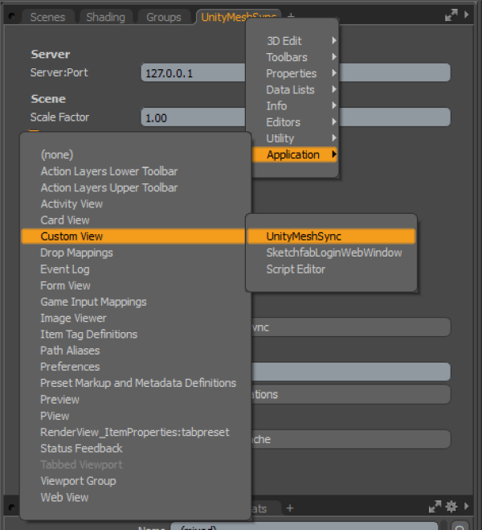

# Installation

1. [Maya](#maya)
1. [3ds Max](#3ds-max)
1. [MotionBuilder](#motionbuilder)
1. [Blender](#blender)
1. [Metasequoia](#metasequoia)
1. [Modo](#modo)

## Maya



1. MeshSync と同じバージョンを持つ最新の Maya プラグインを[リリース](https://github.com/Unity-Technologies/MeshSyncDCCPlugins/releases)から取得。  
   見つからない場合は、[手動でビルド](../en/BuildDCCPlugins.md) (現在英語のみ) をするか、[issueを作成し](https://github.com/Unity-Technologies/MeshSyncDCCPlugins/issues/new)、ご連絡を下さい。
1. プラグインをコピーする
   - Windows:   
     `MAYA_APP_DIR` の環境変数が設定されている場合はそこにコピーする。  
     ない場合は `%USERPROFILE%\Documents\maya` ( Explorer のアドレスバーへコピペで直行) に *modules* ディレクトリをそのままコピーする。
   - Mac:   
     `/Users/Shared/Autodesk/modules/maya` に *UnityMeshSync* ディレクトリと *UnityMeshSync.mod* ファイルをコピーする。
   - Linux:   
     `~/maya/<maya_version>` に *modules* ディレクトリをそのままコピーする。  

1. Maya を起動し、Windows -> Settings/Preferences -> Plug-in Manager を開く。
1. MeshSyncClient の Loaded にチェックを入れてプラグインを有効化する。
1. シェルフ UI に UnityMeshSync が追加されているはずです。  
   歯車アイコンで設定メニューを開き、MeshSync と色々遊んでみましょう。

## 3ds Max



1. MeshSync と同じバージョンを持つ最新の 3ds Max プラグインを[リリース](https://github.com/Unity-Technologies/MeshSyncDCCPlugins/releases)から取得。  
   見つからない場合は、[手動でビルド](../en/BuildDCCPlugins.md) (現在英語のみ) をするか、[issueを作成し](https://github.com/Unity-Technologies/MeshSyncDCCPlugins/issues/new)、ご連絡を下さい。
1. 3ds Max を起動する。
1. 下記のどちらかのフォルダーに、使用されている 3ds Max のバージョンに該当する *MeshSyncClient3dsMax.dlu* をコピーする。
   - **(推奨)**　追加されたプラグイン用のパス。このメニューで追加できます：
     * 3ds Max 2019 以前: Customize -> Configure System Paths をクリックし、*3rd Party Plug-Ins* タブを選択する。
     * 3ds Max 2020: Customize -> Configure User and System Paths をクリックし、*3rd Party Plug-Ins* タブを選択する。
   - 3ds Max のインストールパスの下にあるプラグイン用のパス。  
     例：`C:\Program Files\Autodesk\3ds Max 2019\Plugins`
1. 3ds Max を再起動する。
1. メインメニューバーに "UnityMeshSync" が追加されたのを確認する。
   それの "Window" から設定ウィンドウを開けます。
   - メニューバーを編集する場合、Action に "UnityMeshSync" カテゴリが追加
     されているので、そちらから MeshSync の機能にアクセスできます。

## MotionBuilder




1. MeshSync と同じバージョンを持つ最新の MotionBuilder プラグインを[リリース](https://github.com/Unity-Technologies/MeshSyncDCCPlugins/releases)から取得。  
   見つからない場合は、[手動でビルド](../en/BuildDCCPlugins.md) (現在英語のみ) をするか、[issueを作成し](https://github.com/Unity-Technologies/MeshSyncDCCPlugins/issues/new)、ご連絡を下さい。
1. MotionBuilder を起動する。
1. Settings -> Preferences -> SDK メニューをクリックし、プラグイン用のパスを追加する 
1. プラグイン用のパスに、使用されている MotionBuilder のバージョンに該当する *MeshSyncClientMotionBuilder.dll* をコピーする。
1. MotionBuilder を再起動する。
1. Asset Browser 内の Templates -> Devices フォルダーに "UnityMeshSync" が追加されたのを確認する。
1. "UnityMeshSync" をシーンに追加する。
1. Navigator 内の Devices -> UnityMeshSync を選択することで、MeshSync の各種設定や機能にアクセスできます。 

## Blender
   
1. MeshSync と同じバージョンを持つ最新の Blender プラグインを[リリース](https://github.com/Unity-Technologies/MeshSyncDCCPlugins/releases)から取得。  
   見つからない場合は、[手動でビルド](../en/BuildDCCPlugins.md) (現在英語のみ) をするか、[issueを作成し](https://github.com/Unity-Technologies/MeshSyncDCCPlugins/issues/new)、ご連絡を下さい。

1. Blender を起動する。
1. Blender のバージョンによって、インストールする方法が少々違います
   - Blender 2.79:
     * File -> User Preferences -> Add-ons を開く。
     * 画面下部の "Install Add-on from file" を押し、プラグインの zip ファイルを指定する。
     * "Import-Export: Unity Mesh Sync" が追加されたのを確認する。        
   - Blender 2.80 以降:
     * Edit -> User Preferences を開く。 
     * ウィンドウの右上の "Install" をクリックし、プラグインの zip ファイルを指定する。
     * "Import-Export: Unity Mesh Sync" が "Add-ons" タブに追加されたのを確認する。

     

1. "Import-Export: Unity Mesh Sync" をチェックし、有効化する。 
1. MeshSync パネルが追加されたのを確認する。
  

   
  
### 注意

Blender のプラグインをインストールする時、古いバージョンのプラグインがあれば、それを事前にアンインストールしておく必要があります。  
アンインストールの手順：

1. Add-ons メニューから "Import-Export: Unity Mesh Sync" を選択。
1. "Remove" ボタンをクリック。
1. Blender を再起動。
  
  
## Metasequoia
1. MeshSync と同じバージョンを持つ最新の Metasequoia プラグインを[リリース](https://github.com/Unity-Technologies/MeshSyncDCCPlugins/releases)から取得。  
   見つからない場合は、[手動でビルド](../en/BuildDCCPlugins.md) (現在英語のみ) をするか、[issueを作成し](https://github.com/Unity-Technologies/MeshSyncDCCPlugins/issues/new)、ご連絡を下さい。

1. zip ファイルを解凍。
1. Metasequoia を起動する。
1. Help -> About Plug-ins を開き、ウィンドウの左下の "Install" をクリックする。
1. 解凍した zip ファイルの中から、該当するプラグインファイルを指定する。  
   例：*MeshSyncClientMQ472.plugin*
1. Panel -> Unity Mesh Sync を開く。  
   このメニューが見つからない場合、 Plug-in ウィンドウに "Unity Mesh Sync" がチェックされているかを確認する。
   

  


## Modo

1. Modo のライセンスにより、現在[手動のビルド](../en/BuildDCCPlugins.md) (英語のみ) が必要です。
1. Modo を起動する。
2. System -> Add Plug-in をクリックし、Modo のバージョンと該当する *MeshSyncClientModo.lx* を選択する。
4. Modo のタブ UI で、*+* をクリックし、Application -> Custom View -> UnityMeshSync を選択する。
1. UnityMeshSync のビューが追加されたのを確認する。



### 注意

古いバージョンのプラグインがあれば、事前にそれを削除する必要があります。  
削除の手順：
1. 開いた UnityMeshSync のビューをすべて閉じる。
1. Modo を再起動する。

上記の手順をやったにもかかわらず、新しいバージョンのプラグインをインストールできない場合は、
Modo を終了してから、手動の削除を試して下さい。
1. Windows の場合：
   - テキストエディターで設定ファイルを開く。  
     例： `C:\Users\<user_name>\AppData\Roaming\Luxology\MODO<modo_version>.CFG`
   - 下記のような UnityMeshSync の項目を削除する:
     ```
     <hash type="Server" key="12345678-abcd-1234-abcd-111122223333:UnityMeshSync">
       <atom type="Module">C:\ModoPlugins\Modo14\MeshSyncClientModo.lx</atom>
       <atom type="Direct">1</atom>
     </hash>
     ```
   - 設定ファイルを保存し、Modo を起動する。

